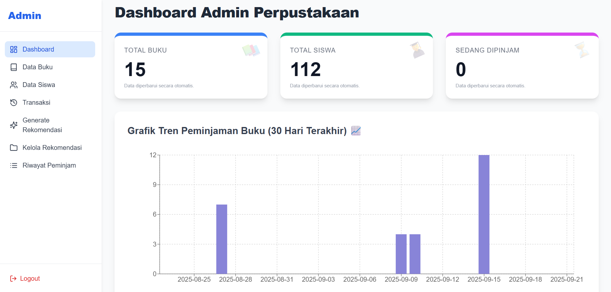
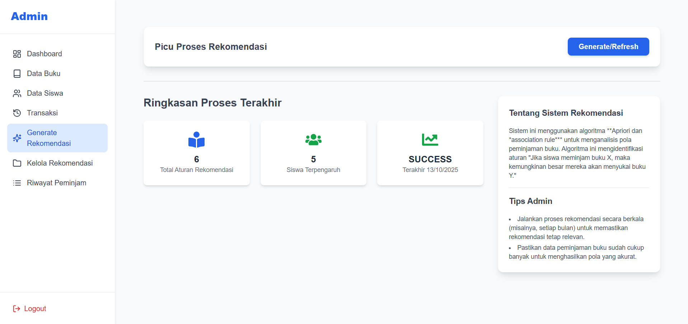
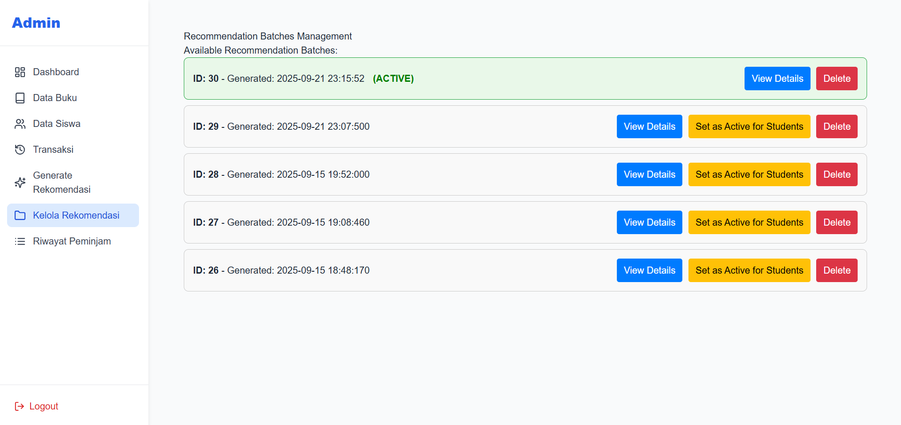
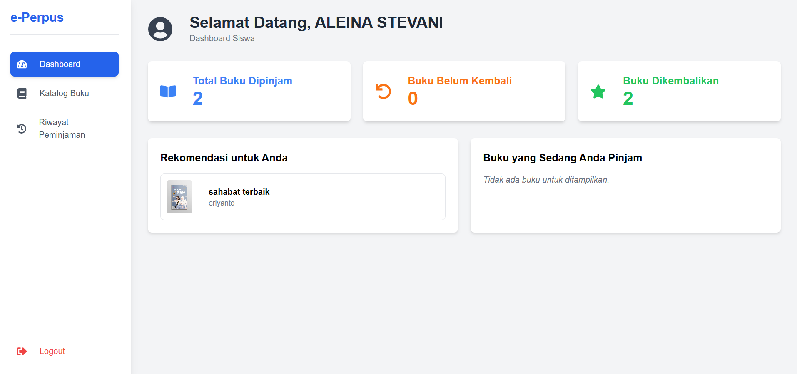
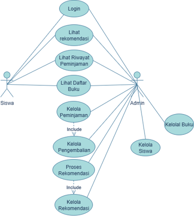
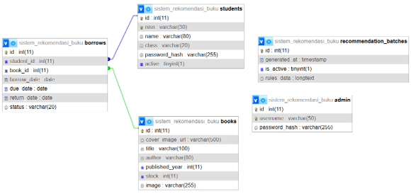

# 📚 e-Perpus

### Sistem Rekomendasi Buku Perpustakaan Berbasis Algoritma Apriori

> Implementasi Association Rule Mining menggunakan Algoritma Apriori untuk membantu proses rekomendasi buku berdasarkan pola peminjaman siswa.

---

# 📸 Tampilan Sistem

### Dashboard Admin


### Generate Recommendation


### Recommendation Batch Management


### Dashboard Siswa


---

# 📖 Gambaran Umum

e-Perpus merupakan sistem informasi perpustakaan sekolah yang dikembangkan untuk membantu pengelolaan data buku, data siswa, transaksi peminjaman, serta menyediakan fitur rekomendasi buku secara otomatis menggunakan Algoritma Apriori.

Berbeda dengan sistem perpustakaan konvensional, e-Perpus tidak hanya berfungsi sebagai media pencatatan transaksi, tetapi juga mampu menganalisis pola peminjaman siswa untuk menghasilkan rekomendasi buku yang relevan berdasarkan data historis peminjaman.

Sistem dikembangkan menggunakan arsitektur terpisah antara frontend, backend, database, dan engine pemrosesan Apriori sehingga mendukung pengelolaan data serta proses rekomendasi yang lebih fleksibel.

---

# ❗ Latar Belakang Masalah

Pada perpustakaan sekolah, siswa sering mengalami kesulitan dalam menemukan buku lain yang relevan setelah membaca suatu buku.

Beberapa permasalahan yang ditemukan antara lain:

- Belum adanya sistem rekomendasi buku otomatis.
- Pemilihan buku masih dilakukan secara manual.
- Data riwayat peminjaman belum dimanfaatkan secara optimal.
- Sulit menemukan pola keterkaitan antar buku yang sering dipinjam bersama.
- Pengelolaan rekomendasi masih bergantung pada pengalaman petugas perpustakaan.

Untuk mengatasi permasalahan tersebut, sistem memanfaatkan teknik Data Mining menggunakan Algoritma Apriori untuk menghasilkan rekomendasi buku berdasarkan pola peminjaman siswa.

---

# 💡 Solusi yang Ditawarkan

e-Perpus menerapkan konsep Association Rule Mining menggunakan Algoritma Apriori untuk menemukan hubungan antar buku berdasarkan data transaksi peminjaman.

Contoh aturan yang dihasilkan:

```text
Jika siswa meminjam:
"Setia Untuk Hati"

Maka kemungkinan juga menyukai:
"Sahabat Sejak Kecil"
```

Aturan-aturan tersebut kemudian digunakan sebagai dasar dalam memberikan rekomendasi buku kepada siswa.

---

# 🎯 Tujuan Sistem

Sistem ini bertujuan untuk:

- Mengelola data buku dan data siswa secara terpusat.
- Mendukung proses pencatatan peminjaman dan pengembalian buku.
- Menghasilkan rekomendasi buku berdasarkan pola peminjaman.
- Membantu siswa menemukan buku yang relevan.
- Memanfaatkan data historis peminjaman sebagai sumber pengetahuan.
- Mendukung pengambilan keputusan berbasis data pada pengelolaan perpustakaan.

---

# 👨‍💻 Peran Pengembang

Proyek ini dikembangkan secara penuh sebagai proyek freelance akademik.

Ruang lingkup pekerjaan yang dilakukan meliputi:

- Requirements Analysis
- Business Process Analysis
- Database Design
- System Design
- Frontend Development
- Backend Development
- API Development
- MySQL Database Implementation
- Python Apriori Integration
- Recommendation Engine Development
- System Testing

---

# 🏗️ Arsitektur Sistem

Karena sistem menggunakan beberapa komponen yang saling terintegrasi, arsitekturnya dapat digambarkan sebagai berikut:

```text
Admin / Student
        │
        ▼
React.js Frontend
        │
        ▼
Node.js REST API
        │
 ┌──────┴──────┐
 ▼             ▼
MySQL      Python
Database   Apriori Engine
      │
      ▼
Recommendation Batch
```

Komponen utama:

- React.js sebagai frontend application.
- Node.js sebagai backend REST API.
- MySQL sebagai database utama.
- Python sebagai engine pemrosesan Algoritma Apriori.
- Recommendation Batch sebagai penyimpanan hasil Association Rules.

---

# 📋 Use Case Diagram



Aktor utama yang terlibat dalam sistem:

### Admin

- Login
- Kelola Buku
- Kelola Siswa
- Catat Peminjaman
- Catat Pengembalian
- Generate Recommendation
- Manage Recommendation Batch
- Lihat Riwayat Peminjaman

### Siswa

- Login
- Lihat Katalog Buku
- Lihat Riwayat Peminjaman
- Lihat Rekomendasi Buku

---

# 🗄️ Entity Relationship Diagram (ERD)



Database terdiri dari lima tabel utama:

| Tabel | Fungsi |
|---------|---------|
| admin | Data administrator sistem |
| students | Data siswa |
| books | Data koleksi buku |
| borrows | Data transaksi peminjaman |
| recommendation_batches | Data hasil Association Rules |

---

# 🔄 Workflow Sistem Rekomendasi


Alur proses rekomendasi:

1. Data transaksi peminjaman tersimpan pada database.
2. Admin menjalankan proses Generate Recommendation.
3. Sistem mengambil data riwayat peminjaman dari MySQL.
4. Python Apriori Engine memproses data transaksi.
5. Sistem menghasilkan Association Rules.
6. Rules disimpan sebagai Recommendation Batch baru.
7. Admin memilih batch yang akan diaktifkan.
8. Sistem menggunakan batch aktif untuk memberikan rekomendasi kepada siswa.

---

# 🧠 Implementasi Algoritma Apriori

Sistem menggunakan Algoritma Apriori untuk menemukan hubungan antar buku berdasarkan data transaksi peminjaman.

Parameter yang digunakan:

```python
min_support = 0.4
min_confidence = 0.5
```

Proses yang dilakukan:

1. Mengambil data riwayat peminjaman dari database.
2. Membentuk itemset transaksi.
3. Menghitung nilai support.
4. Menghasilkan frequent itemset.
5. Membentuk Association Rules.
6. Menghitung confidence setiap aturan.
7. Menyimpan hasil aturan ke Recommendation Batch.

---

# 📦 Recommendation Batch Mechanism

Salah satu fitur utama sistem adalah Recommendation Batch Management.

Setiap kali administrator menjalankan proses Generate Recommendation:

```text
Borrowing History
        ↓
Apriori Processing
        ↓
Association Rules
        ↓
Create New Batch
        ↓
Save To Database
```

Karakteristik sistem:

- Setiap proses generate menghasilkan batch baru.
- Batch lama tetap tersimpan sebagai histori.
- Hanya satu batch yang dapat aktif pada satu waktu.
- Batch aktif digunakan sebagai sumber rekomendasi.
- Administrator dapat mengganti batch aktif tanpa perlu menjalankan proses Apriori ulang.

---

# ✨ Fitur Utama

### Book Management

- Tambah buku
- Edit buku
- Hapus buku
- Kelola stok buku

### Student Management

- Tambah siswa
- Edit siswa
- Arsip siswa
- Filter berdasarkan kelas
- Pencarian siswa

### Borrowing Management

- Pencatatan peminjaman
- Pencatatan pengembalian
- Monitoring status pinjaman

### Recommendation Engine

- Generate recommendation menggunakan Apriori
- Association Rule Mining
- Recommendation Batch Management

### Student Dashboard

- Riwayat peminjaman
- Daftar buku
- Rekomendasi buku personal

---

# 📊 Hasil Implementasi

Sistem berhasil mengimplementasikan:

- Pengelolaan buku dan siswa.
- Pencatatan transaksi peminjaman.
- Pengelolaan pengembalian buku.
- Pemrosesan Association Rules menggunakan Apriori.
- Penyimpanan hasil rekomendasi dalam Recommendation Batch.
- Aktivasi batch rekomendasi secara dinamis.
- Pemberian rekomendasi buku berdasarkan riwayat peminjaman.

---

# 🧩 Tech Stack

| Layer | Technology |
|---------|------------|
| Frontend | React.js (Vite) |
| Backend | Node.js |
| Database | MySQL |
| Recommendation Engine | Python |
| API Testing | Postman |
| Development Tools | VS Code |

---

# 📂 Struktur Proyek

```text
e-perpus/
│   ├── src/
│   └── public/
│
├── backend/
│   ├── routes/
│   ├── controllers/
│   ├── models/
│   └── services/
│
├── apriori/
│   ├── apriori.py
│   └── recommendation_engine.py
│
├── database/
│   └── schema.sql
│
├── assets/
├── docs/
└── README.md
```

(Sesuaikan kembali dengan struktur repository asli Anda)

---

# 🎓 Kontribusi Akademik

Proyek ini menunjukkan implementasi nyata dari:

- Information System Development
- Database Design
- Association Rule Mining
- Apriori Algorithm
- Recommendation System
- Full-Stack Web Development
- Data-Driven Decision Support

dalam studi kasus rekomendasi buku perpustakaan sekolah.

---

# 👨‍💻 Author

**Wahyu Tri Kumolo Adi**

Sarjana Sistem Informasi  
Universitas Islam Nahdlatul Ulama Jepara

📧 wahyutrikum@gmail.com

🌐 GitHub: https://github.com/wahyugan1
